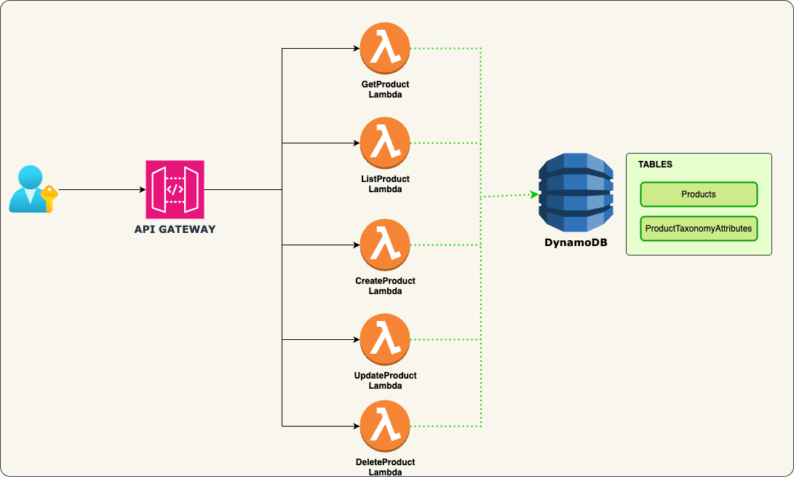

# lambda-microservice
Code shows how we can use lambda as a microservoce

This is a ecommerce project using  AppSync and DynamoDB


## Architecture



## Prerequisites

- Node.js 22.x
- AWS Account
- Serverless Framework
- Cloudformation

## Setup

1. Clone the repository
2. Install dependencies
   ```bash
   npm install
   ```
3. Deploy the service:
   ```bash
   npm run deploy
   ```

## Project Structure

- 'mapping-templates' - Contains the AppSync mapping templates for the GraphQL API
- 'serverless.yaml' - Contains the Serverless Framework configuration files
- 'buildspec.yml' - Contains the buildspec for the AWS CodeBuild project


## Database Schema

 ### Products Table 
| Attribute | Type | Description |
| --- | --- | --- |
| ProductId | String | Unique identifier for the product |
| Name | String | Name of the product |
| Description | String | Description of the product |
| Price | Number | Price of the product |
| Category | String | Category of the product |
| Stock | String | Inventory count |
| createdAt | String | Date and time when the product was created |
| updatedAt | String | Date and time when the product was last updated |

### ProductTaxonomyAttributes Table

| Attribute | Type | Description |
| --- | --- | --- |
| TaxonomyId | String | A unique identifier for each category or tag.|
| Description | String |A brief description of the category or tag|
| ParentId | String |An identifier linking to the parent category for hierarchical structures. For top-level categories, this could be null or a specific value like "root".|
| Type | String |Distinguishes between different types of taxonomy, such as 'category' or 'tag'.|

### GraphQL Operations

- createProduct
- updateProduct
- deleteProduct
- getProduct
- listProducts
- getProductTaxonomyAttributes
- listProductTaxonomyAttributes
